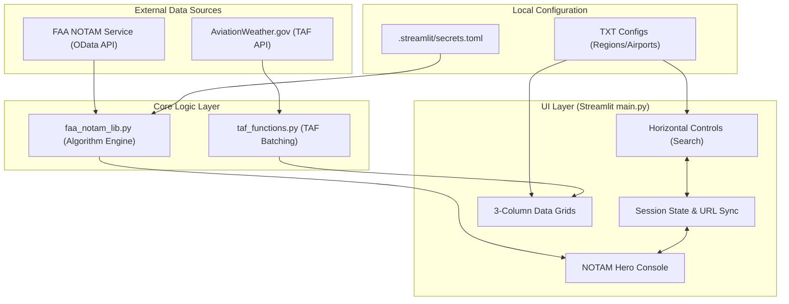

# Architecture Design Document: TAF & NOTAM Dashboard

## 1. System Overview & Philosophy
The **TAF Information Dashboard** is designed primarily for aviation dispatchers who require high-density, low-latency access to critical weather and operational data. 

**Core Engineering Philosophy (The "Why"):**
- **Zero Click / Instancy:** Dispatchers cannot wait for slow authentications or paginated tables. Data must load immediately and auto-refresh.
- **Situational Awareness over Aesthetics:** Vertical space is maximized. Critical alerts (Runway closures, Freezing Rain) must visually pop out via color coding and forced sorting.
- **Data Integrity is Paramount:** A false-positive data merge (hiding a distinct crane obstruction because it looks similar to another) is a critical safety failure.

---

## 2. Context & Data Flow

### 2.1 State Management (URL Sync)
To allow dispatchers to bookmark and share specific views, the application state tightly couples Streamlit's internal `session_state` with the browser's `query_params`.
- `?notam=KJFK` forces the Hero Console to open instantly upon page load.
- Changing regions or closing the console definitively purges the URL parameter to prevent "ghost" data from reappearing on back-navigation.

---

## 3. Core Algorithms

### 3.1 Two-Stage Conservative Deduplication (`faa_notam_lib.py`)
**The Problem:** The raw FAA feed often contains duplicates (e.g., a Domestic version and an International version of the exact same taxiway closure). Previous fuzzy-text regex matching was slow ($O(N^2)$) and prone to false merges (hiding distinct concurrent events).

**The Solution:** A deterministic, dual-stage lock mechanism.

1. **Stage 1 (The Signature Hash):** 
   Extract an event's immutable physical properties: `(Location, Start Time, End Time, Q-Code)`. Only if these 4 keys perfectly match do we consider them candidates for merging. This is extremely fast $O(1)$ lookups.
   
2. **Stage 2 (Conservative Fallback):**
   If the signature matches, we check the classification:
   - **Different (DOM vs INTL):** True duplicate. Merge and prioritize INTL format.
   - **Same (DOM vs DOM):** Edge Case Danger (e.g., two different cranes raised at the exact same minute). We apply a **100% exact text match** requirement. If `text1 != text2` by even a single character, we abort the merge and show both. Safety first.

### 3.2 Multi-Key Priority Sorting (`main.py`)
**The Problem:** Dispatchers need to see the most dangerous operational impacts immediately, but within normal noise, chronological order is best.

**The Solution:** A Tuple-Based Sort Matrix.
The `get_notam_metrics` function parses the raw data into a sorting tuple: `(Priority_Tier, -Unix_Timestamp)`.

| Tier | Logic Trigger | Example | Primary Sort |
| :--- | :--- | :--- | :--- |
| **0** | Q-Code Subject is `MR` (Runway) or `FA` (Aerodrome) | Aerodrome Closed | Top Priority |
| **1** | Raw text contains `CLOSED`, `CLSD`, `U/S` | ILS Unserviceable | High Priority |
| **2** | Raw text contains `RWY`, `RUNWAY` | WIP adjacent to RWY | Medium Priority |
| **3** | Catch-all | Crane erected 5NM away | Standard |

**Chronological Tie-Breaker:** When two NOTAMs share the same Tier (e.g., two Tier 0 runway closures), the `-Unix_Timestamp` (derived from the `issued` JSON property) forces Python's `sorted()` to mechanically order them from newest to oldest.

---

## 4. Technical Debt & Future Considerations
- **API Rate Limiting:** Currently, the FAA API token is fetched frequently. If usage scales, implement robust token caching mapped to the `expires_in` payload.
- **Error Handling:** Streamlit swallows some API timeout exceptions. A persistent retry-backoff queue for network failures during `requests.get()` would stabilize the app on flaky hotel Wi-Fi.
