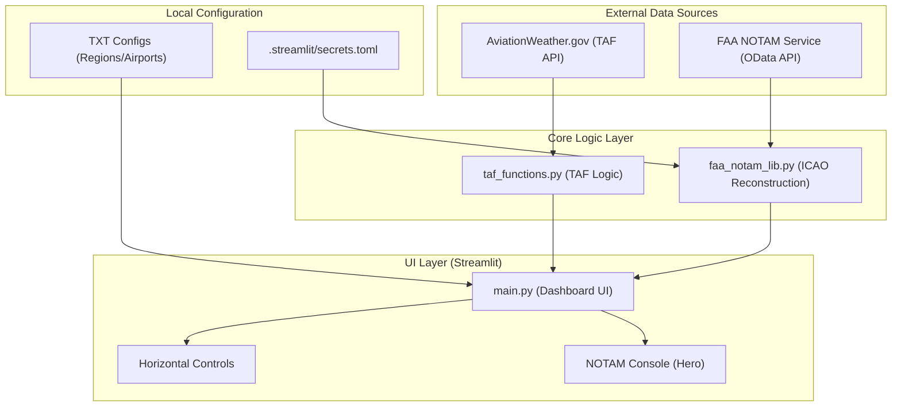

# TAF Information Dashboard ✈️

A high-performance Streamlit-based aviation weather monitoring dashboard for Terminal Aerodrome Forecast (TAF) and NOTAM data. Optimized for aviation dispatchers with focus on professional standards and space efficiency.

## ✨ Features

- 🚀 **Direct Access**: Instant access - no authentication delay.
- 🔄 **Auto-refresh**: Updates every 10 minutes (logic optimized at script end for clean layout).
- 🧭 **Professional NOTAM Console**:
  - **ICAO 5-Part Reconstruction**: Precise `Q`, `A`, `B`, `C`, `D`, `E` lines restoration.
  - **3-Column Layout**: High-density display to minimize scrolling.
  - **Smart Filtering**: Automatic exclusion of `NOTAMC` (Cancellation NOTAMs) to focus on active notices.
  - **RWY Detection**: Integrated regex to prioritize and badge runway-specific NOTAMs.
  - **Data Integrity (conservative)**: Robust two-stage deduplication layer that merges redundant Domestic/International NOTAM pairs (~20-50% noise reduction) requiring a 100% exact text match for same-classification collisions to ensure zero false merges.
  - **Prioritized Chronological Sorting**: NOTAMs are sorted first by Operational Priority (Runway/Aerodrome closures) and secondarily by Issue Timestamp (descending) to guarantee the freshest critical data is always at the top.
- 🗺️ **Region Filtering**: Instant filtering of airport groups (Destinations, Alternates, ERAs).
- 📊 **Dual Panel View**: Side-by-side display for main destinations vs. EDTO ERAs.
- 🎨 **Expert Weather Highlighting**:
  - 🔴 **Red**: Low visibility (<3000m)
  - 🩷 **Pink**: Low cloud ceiling (<1000ft) 
  - 🟣 **Purple**: Unmeasured visibility (VV///)
  - 🔵 **Blue**: Freezing conditions (FZRA, FZDZ)
  - 🟢 **Green/Blue**: Snow conditions
- ⚡ **Performance Rework**: **O(1) Batch Fetching** - fetches all regional data in a single API call instead of sequential requests.

## 🚀 Quick Start

### Simple Launch (Recommended)
```bash
chmod +x start.sh
./start.sh
```

## ⚙️ Project Structure

```
checkTAF/
├── main.py                # Main UI (Optimized vertical spacing & Header compaction)
├── taf_functions.py       # Core TAF processing & Batch API logic
├── faa_notam_lib.py       # (NEW) Professional FAA NOTAM Integration
├── start.sh               # Smart launcher script
├── .streamlit/secrets.toml # Secure API credential storage (ignored by git)
└── requirements.txt       # Dependencies
```

## 🏗️ Architecture & Flow



### 1. Vertical Space Optimization (Dispatcher Mode)
To ensure maximum situational awareness, we've implemented:
- **Header Compaction**: Hidden the default Streamlit header and reduced top padding to `0rem`.
- **Horizontal Controls**: Merged Airport Title, Search Box, and Close controls into a single row.
- **Hero-Style Console**: The NOTAM console is moved to the top of the page for absolute stability.

### 2. NOTAM Professional Format
The `faa_notam_lib.py` module handles the raw FAA data to reconstruct the standard ICAO format:
- **ID Formatting**: Standard `SeriesNumber/Year` (e.g., `W0164/26`).
- **Font Consistency**: Forced 11px Monospace CSS isolation to prevent browser font boosting in long telegrams (e.g., VMMC long NOTAMs).

### 3. State & Persistence
- **URL-Synced Filters**: "Region" and "Show All" selections are preserved in URL query parameters (`?region=...&show_all=...`), allowing you to book-mark specific filtered views or share links.
- **Zero-Ghost NOTAMs**: NOTAM console state is also synced with URL parameters but cleared definitively when switching regions or clicking "Close", ensuring no stale data "pops up" later.

## 📁 Configuration
- `Region.txt`: Maps regions to sets of destination airports.
- `Airport_list.txt`: Maps destinations to their corresponding alternates.
- `Enroute_Alternates.txt`: Lists EDTO ERAs by region.

## 🔧 Installation
```bash
# Setup Environment
python3 -m venv venv
source venv/bin/activate
pip install -r requirements.txt

# Configure Secrets
mkdir .streamlit
echo 'FAA_CLIENT_ID = "your_id"\nFAA_CLIENT_SECRET = "your_secret"' > .streamlit/secrets.toml
```

---
**Maintained by expert dispatchers for safety and efficiency.**
